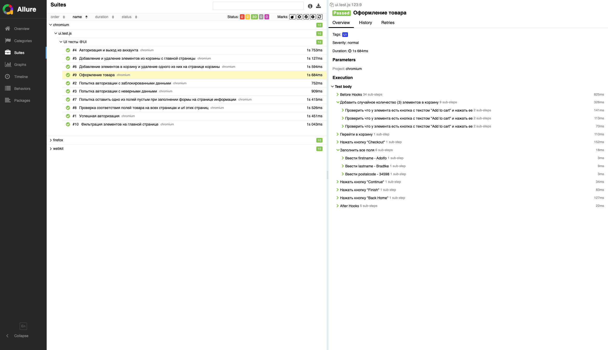
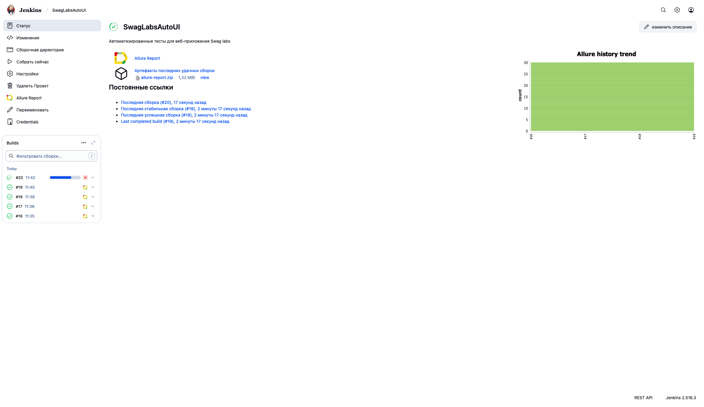
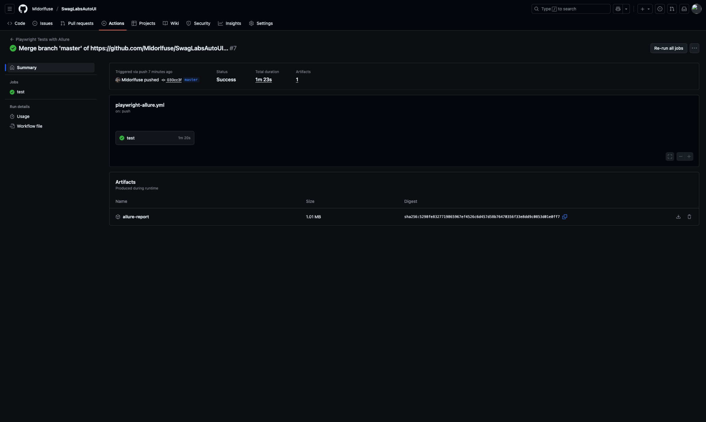

# 🧪 UI-тесты на Playwright


## 📌 Описание
Автоматизированные тесты для веб-приложения [Swag labs](https://www.saucedemo.com/) с использованием [Playwright](https://playwright.dev/).  
Поддерживается:
- ✅ Кросс-браузерное тестирование (Chromium, Firefox, WebKit)  
- ✅ Page Object Model (POM)  
- ✅ Генерация отчетов (Allure Report)  
- ✅ Запуск в CI/CD (GitHub Actions, Jenkins)  

Список автотестов
- ✅ Успешная авторизация
- ✅ Попытка авторизации с заблокированными данными
- ✅ Попытка авторизации с неверными данными
- ✅ Авторизация и выход из аккаунта
- ✅ Добавление и удаление элементов из корзины с главной страницы
- ✅ Добавление элементов в корзину и удаление одного из них на странице корзины
- ✅ Попытка оставить одно из полей пустым при заполнении формы на странице информации
- ✅ Проверка соответствия полей товара на всех страницах и url этих страниц
- ✅ Оформление товара
- ✅ Фильтрация элементов на главной странице
---

## 🚀 Установка

### 1. Клонировать репозиторий
```
git clone https://github.com/Mldorlfuse/SwagLabsAutoUI.git

cd SwagLabsAutoUI
```

### 2. Установить зависимости
```
npm install
```

---

## ▶️ Запуск тестов

### Все тесты
```
npx playwright test
```

### В конкретном браузере
```
npx playwright test --project=chromium
npx playwright test --project=firefox
npx playwright test --project=webkit
```

### По тегу тестов
```
npx playwright test --grep @UI
```

### В headed-режиме (видимый браузер)
```
npx playwright test --headed
```

---


## 📊 Отчет Allure Report

### Генерация отчета 

```
npx allure generate ./allure-results --clean -o ./allure-report
```
### Открытие отчета
```
npx allure open ./allure-report
```



---

## 🏗 Jenkins

```
pipeline {
    agent any

    tools {
        nodejs "NodeJS_18"
    }

    stages {
        stage('Checkout') {
            steps {
                git branch: 'master', url: 'https://github.com/Mldorlfuse/SwagLabsAutoUI.git'
            }
        }

        stage('Install dependencies') {
            steps {
                sh '''
                    npm ci
                    npx playwright install --with-deps
                '''
            }
        }

        stage('Run tests') {
            steps {
                sh 'npx playwright test'
            }
        }

        stage('Generate Allure Report') {
            steps {
                sh 'npx allure generate allure-results --clean -o allure-report'
            }
        }

        stage('Publish Allure Report') {
            steps {
                allure([
                    includeProperties: false,
                    jdk: '',
                    results: [[path: 'allure-results']]
                ])
            }
        }
    }
}

```



---

## 🤖 GitHub Actions

```
name: Playwright Tests with Allure

on:
  workflow_dispatch:
  push:
    branches: [ "master" ]
  pull_request:
    branches: [ "master" ]

jobs:
  test:
    runs-on: macos-latest

    steps:
      - name: Checkout repository
        uses: actions/checkout@v4

      - name: Setup Node.js
        uses: actions/setup-node@v3
        with:
          node-version: lts/*


      - name: Install dependencies
        run: npm i
      - name: Install Playwirght
        run: npx playwright install --with-deps

      - name: Install Allure CLI
        run: npm install --save-dev allure-commandline@2.25.0

      - name: Run Playwright tests
        run: npx playwright test

      - name: Generate Allure report
        run: npx allure generate allure-results --clean -o allure-report

      - name: Upload Allure report as artifact
        uses: actions/upload-artifact@v4
        with:
          name: allure-report
          path: allure-report
```


